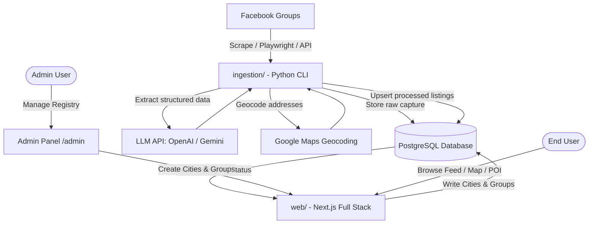

# System Architecture

Basera aggregates house-rental postings scraped from Facebook groups into a searchable per-city feed, geolocates listings, displays them on a map, and redirects users to Facebook to contact posters directly.

## Component Overview

The system is split into three main components: a Python ingestion engine, a full-stack Next.js web application, and a shared PostgreSQL database.

---

## Component Details

### 1. Ingestion Engine (`ingestion/`)
A Python CLI package that manages scraping, processing, and loading listing data.
* **Scraper**: Pulls posts from Facebook groups using Playwright browser automation or the Facebook Graph API.
* **Extractor (LLM)**: Takes raw post text and parses structured details (rent, BHK, gender preference, furnishing status, suitability) using JSON Schema tool calling.
* **Geocoder**: Resolves addresses/neighborhoods into coordinate coordinates using Google Maps.
* **Loader**: Performs atomic upserts into the shared Postgres database.

### 2. Web Application (`web/`)
A Next.js 16 (App Router + TypeScript) web application serving end-users and administrators.
* **User Feed**: Interactive interface with responsive filters (rent, BHK, gender, furnishing, date) and pagination.
* **Map View**: Uses Leaflet and OpenStreetMap to render coordinates, computing distances dynamically relative to a Point of Interest (POI) configured by the user.
* **Admin Dashboard (`/admin`)**: Environment-token-secured dashboard for enabling/disabling cities and managing the registered Facebook groups registry.
* **Drizzle ORM**: Serves as the database abstraction and holds the authoritative database migrations.

### 3. Shared Database (Postgres)
The database serves as the interface contract between the Web app and the Ingestion CLI.
* The web app manages the **city and group registry**.
* The ingestion CLI reads the active city/group registry, performs ingestion, and updates the listings database.
* To keep both systems decoupled but consistent, the schema is mirrored.

---

## Shared Database Contract

To ensure that the Python engine and TypeScript web app can interact safely, we maintain the following rules:

1. **Schema Ownership**: The Next.js application owns the database schema and is the only system allowed to generate and execute migrations. Drizzle Kit outputs standard SQL migrations in the [web/drizzle/](file:///home/chandresh/code/basera/web/drizzle) folder.
2. **Read-Only / Additive Database Changes**: Changes to columns are additive (nullable or default-valued) to ensure old code does not break. Python table definitions in [ingestion/db/tables.py](file:///home/chandresh/code/basera/ingestion/db/tables.py) mirror [web/src/db/schema.ts](file:///home/chandresh/code/basera/web/src/db/schema.ts).
3. **Upsert Logic**: The Python engine performs inserts with `ON CONFLICT (source, source_id) DO UPDATE` to ensure runs are idempotent.
4. **Flexible Schema Constraints**: Extracted LLM enums (such as BHK, furnishing status, and gender preference) are stored as text columns rather than database-level enums to avoid migrations and prevent inserts from failing if the LLM output drifts slightly. Normalization is handled at render-time in the web app.

---

## Table Schemas

### `cities`
Specifies which cities are supported. Controlled by the Admin Panel.
* `id` (`bigserial`, Primary Key)
* `name` (`text`): City name (e.g., "Pune").
* `slug` (`text`, Unique Index): URL slug (e.g., "pune").
* `enabled` (`boolean`): If false, the city and its listings are hidden globally.
* `display_order` (`integer`): For sorting in selector drop-downs.
* `center_lat`/`center_lng` (`double precision`): Leaflet map starting coordinates.
* `created_at` (`timestamp with time zone`)

### `groups`
Facebook groups registry representing listing sources.
* `id` (`bigserial`, Primary Key)
* `city_id` (`bigint`, Foreign Key referencing `cities.id`): Group scoping.
* `url` (`text`, Unique Index): Public Facebook Group URL.
* `name` (`text`): Group name.
* `fb_group_id` (`text`): Graph API Group ID (optional).
* `enabled` (`boolean`): If false, scraping is skipped.
* `created_at` (`timestamp with time zone`)

### `listings`
Structured records computed from scraping and extraction.
* `id` (`bigserial`, Primary Key)
* `source` (`text`): Source platform (`facebook`, `telegram`, `whatsapp`).
* `source_id` (`text`): Unique post ID from source platform.
* `source_url` (`text`): Link to the original source post.
* `source_group` (`text`): Source group URL.
* `posted_at` (`timestamp with time zone`): Extracted posting timestamp.
* `scraped_at` (`timestamp with time zone`): Database ingestion timestamp.
* `location` (`text`): Extracted neighborhood or address text.
* `city` (`text`): Denormalized city name for display.
* `city_id` (`bigint`, Foreign Key referencing `cities.id`): Used for URL scoping.
* `rent` (`integer`): Monthly rent.
* `bhk` (`text`): Room count details (e.g. "2 BHK").
* `gender_preference` (`text`): `any`, `male`, `female`, `family`, or `bachelor`.
* `furnishing_status` (`text`): `unfurnished`, `semi furnished`, `fully furnished`.
* `additional_details` (`text`): Free-text summary of other listing details.
* `latitude`/`longitude` (`double precision`): Coordinates from geocoding.
* `original_text` (`text`): The raw captured post body.
* `contact_name` (`text`): Extracted poster name.
* `contact_url` (`text`): Link to contact the poster on Facebook.
* `is_rental` (`boolean`): Flag designating whether post is a rental.
* `status` (`text`): `active`, `stale`, or `hidden`.

### `raw_posts`
Raw capture storage used to isolate scraping from LLM processing.
* `id` (`bigserial`, Primary Key)
* `source` (`text`), `source_id` (`text`): Deduplication key.
* `source_group` (`text`), `source_url` (`text`)
* `text` (`text`): Scraped raw text.
* `posted_at` (`timestamp with time zone`), `scraped_at` (`timestamp with time zone`)
* `author_name` (`text`), `author_url` (`text`)
* `meta` (`jsonb`): Stores browser snapshots references or API responses.
* `processed_at` (`timestamp with time zone`): Timestamp when processed by AI.

### `scrape_runs`
Tracks run history and status of the Ingestion CLI.
* `id` (`bigserial`, Primary Key)
* `source` (`text`), `target` (`text`): Task scope identifiers.
* `started_at` (`timestamp with time zone`), `finished_at` (`timestamp with time zone`)
* `posts_seen` (`integer`): Number of overall items scanned.
* `posts_new` (`integer`): Number of new posts inserted into `raw_posts`.
* `listings_upserted` (`integer`): Number of listings generated/updated.
* `status` (`text`): `running`, `success`, `error`, or `quota_exceeded`.
* `error` (`text`): Ingestion crash stack trace or error message.
